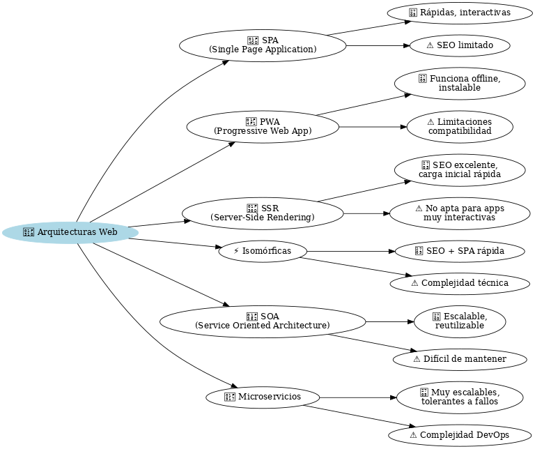

# 🌐 Arquitectura y Tecnologías del Lado del Cliente

Internet está en todos lados: trabajo, ocio, compras, comunicación… Las aplicaciones web son la base de esta experiencia, por eso deben estar diseñadas para ser **rápidas, personalizables y seguras**.

El padre de la **World Wide Web (WWW)** es **Tim Berners-Lee**, quien en 1990 logró la primera comunicación entre cliente y servidor con **HTTP**. Años después fundó el **W3C**, que se encarga de definir y estandarizar las tecnologías que hacen posible la web.

---

## 🖥️ Áreas en entornos cliente/servidor

Las aplicaciones web se apoyan en tres grandes bloques:

* **🔧 Lado del servidor (Backend)**:
  Aquí está toda la “inteligencia” de la aplicación. Incluye el servidor web, bases de datos, APIs y la lógica de negocio. Lenguajes comunes: **PHP, Python, Node.js, Java…**

* **🎨 Lado del cliente (Frontend)**:
  Es lo que ve el usuario en el navegador. Está hecho con **HTML, CSS y JavaScript**, y permite la interacción con la aplicación.

* **🌐 La red**:
  Incluye todo lo necesario para que cliente y servidor se comuniquen, desde el **DNS** hasta las conexiones seguras (HTTPS).

---

## ⚙️ Funcionamiento de un sitio web sencillo

Un ejemplo paso a paso de lo que pasa cuando visitas una página:

1. ✍️ El usuario escribe una **URL** o hace clic en un enlace.
2. 🔎 El navegador busca esa dirección en los **DNS**, que traducen la URL en una dirección **IP**.
3. 📡 El navegador envía una **petición HTTP** al servidor.
4. 📂 El servidor responde con el contenido solicitado (normalmente una página web).
5. 🖼️ El navegador muestra la página al usuario.

---

## 🧩 Componentes de una Aplicación Web

### 🔧 Componentes del lado del servidor

* **DNS y Enrutamiento**: ayudan a localizar tu aplicación en Internet.
* **Balanceadores de carga**: reparten el tráfico entre varios servidores para evitar caídas ⚖️.
* **Bases de datos**: almacenan información frecuente y accesible rápidamente (ejemplo: usuarios).
* **Almacenes de datos**: guardan información histórica o de gran tamaño.
* **Caché**: acelera las respuestas repitiendo contenido ya preparado (Redis, Memcache, CDNs). ⚡
* **Trabajos en segundo plano**: tareas automáticas que no necesitan ejecutarse en tiempo real, como enviar emails o limpiar registros antiguos.

### 🎨 Componentes del lado del cliente

* **Interfaz de usuario (Frontend)**: todo lo que el usuario ve y con lo que interactúa.
* **Lógica en el cliente**: operaciones rápidas que se realizan sin tener que contactar con el servidor, mejorando la velocidad.

---

## 🏗️ Tipos de Arquitecturas Web

Hoy en día existen diferentes arquitecturas, cada una con ventajas e inconvenientes:

### 1️⃣ SPA (Single Page Application) 📝

Toda la aplicación funciona en **una sola página** que carga contenido dinámicamente.
Ejemplo: Gmail, Trello.

✔️ Muy rápidas, interactivas y fáciles de escalar.
❌ Difíciles de optimizar para SEO.

---

### 2️⃣ PWA (Progressive Web App) 📱

Son como las SPA pero con capacidades extra: funcionan **offline**, se pueden instalar en el dispositivo y ofrecen experiencia similar a una app nativa.
Ejemplo: Twitter Lite.

✔️ Compatibilidad multiplataforma y acceso sin conexión.
❌ Limitaciones en algunos navegadores y sistemas operativos.

---

### 3️⃣ SSR (Server-Side Rendering) 🌍

El servidor prepara la página lista y la envía al navegador. Muy útil para blogs o ecommerce.

✔️ Perfectas para SEO y carga inicial rápida.
❌ No recomendadas para aplicaciones muy complejas o con mucha interacción.

---

### 4️⃣ Aplicaciones Isomórficas ⚡

Combinan **SSR + SPA**: primero se renderiza en el servidor y luego se convierte en SPA en el navegador.
Ejemplo: aplicaciones con **Next.js** o **Nuxt.js**.

✔️ SEO y carga inicial rápida + experiencia interactiva.
❌ Más difíciles de programar, requieren conocimientos avanzados.

---

### 5️⃣ SOA (Service Oriented Architecture) 🏢

La aplicación se divide en **servicios independientes**, cada uno con una función de negocio (ejemplo: pagos, usuarios, notificaciones).

✔️ Muy escalables y permiten reutilizar componentes.
❌ Difícil de mantener cuando los servicios son muy grandes o dependientes entre sí.

---

### 6️⃣ Microservicios 🔗

Llevan la idea de SOA al extremo: cada **microservicio** es muy pequeño, independiente y modular.

✔️ Muy escalables, tolerantes a fallos y fáciles de actualizar por separado.
❌ Requieren más infraestructura y son complicados para proyectos pequeños.

---

## 📌 Resumen Final

* Toda aplicación web combina **Frontend, Backend y Red**.
* El **Frontend** se centra en la experiencia del usuario 👩‍💻.
* El **Backend** gestiona la lógica, datos y procesos 🔧.
* Existen diferentes **arquitecturas** (SPA, PWA, SSR, Isomórficas, SOA, Microservicios), y la elección depende de las necesidades de rendimiento, SEO, escalabilidad o mantenimiento.

✨ En pocas palabras: la arquitectura web es la **base que define cómo se conecta, funciona y crece tu aplicación**.

---

## 📊 Tabla comparativa de arquitecturas web

| 🏗️ Arquitectura      | ✅ Ventajas                                               | ⚠️ Inconvenientes                                          |
| --------------------- | -------------------------------------------------------- | ---------------------------------------------------------- |
| **SPA** 📝            | Muy interactivas, rápidas, fáciles de escalar            | Difícil optimización SEO                                   |
| **PWA** 📱            | Funciona offline, multiplataforma, instalable            | Limitaciones en navegadores y actualizaciones complejas    |
| **SSR** 🌍            | Excelente SEO, carga inicial rápida                      | No apta para apps muy complejas                            |
| **Isomórfica** ⚡      | Combina SEO + experiencia rápida tipo SPA                | Mayor complejidad técnica                                  |
| **SOA** 🏢            | Escalable, reutiliza componentes                         | Servicios grandes o dependientes son difíciles de mantener |
| **Microservicios** 🔗 | Altamente escalables, tolerantes a fallos, muy modulares | Complejidad en proyectos pequeños y en DevOps              |

 
 
 

**🧠 Mapa conceptual arquitecturas web**
---

---
 

